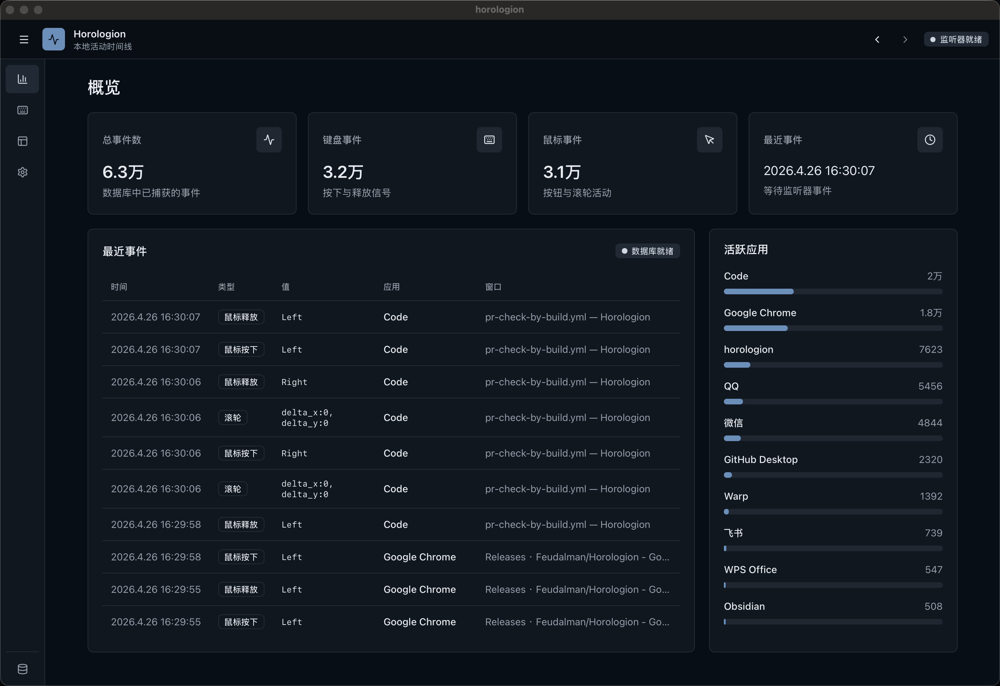

<p align="center">
  
</p>

# Horologion

[English README](README.md)

Horologion 是一个仍处于起步阶段的本地活动时间线工具。当前版本已经完成了最基础的采集、存储和查看能力，但还不是一个成熟稳定的生产级应用：错误处理、日志记录、数据库轮转、数据库清理和备份能力都还没有完善，请谨慎用于生产实践。

请在第一次运行前特别注意：

- Horologion 会在本地持续记录键盘事件、鼠标按钮事件、滚轮事件，以及事件发生时的活动窗口信息。窗口信息可能包含应用名、窗口标题、进程路径和进程 ID。
- 当前数据库使用本地 DuckDB 文件保存，数据会随着使用时间持续增长。项目目前没有自动轮转、自动压缩、快速备份、快速清理或保留策略。
- 如果数据库文件占用磁盘空间过大，需要你手动删除、移动或备份数据库文件。删除数据库文件会清空已采集的数据。
- 配置文件驱动项目行为的能力仍在测试中，接口和格式后续可能变化。当前主要支持默认日志输出等级和默认本地数据库保存位置，更多可配置项会在后续版本中补齐。
- 本项目采集的是本机交互数据，开源版本默认不做云端同步。请不要把包含个人活动记录的数据库文件误提交到仓库或分享给他人。
- 如果你在 macOS 上运行 Horologion，请在启动打包后的应用前先检查所需权限。当前 Horologion 依赖“辅助功能”、“输入监控”和“屏幕录制”权限。如果你在安装后或重复构建后修改了权限，macOS 可能会把新构建识别成一个新的应用身份。若授权完成后仍然无法正常监听，请先彻底退出 Horologion，再重新启动。

## 项目简介

<p align="center">
  
</p>

Horologion 的目标是构建一个跨平台的本地活动记录与观察工具。它在后台监听用户的基础输入事件，并把这些事件和当时的活动窗口上下文写入本地数据库，然后通过桌面应用界面展示成可检索、可分页、可汇总的时间线。

你可以把它理解为一个面向个人研究和本地自动化实验的“活动底座”：它不试图评价你在做什么，而是先可靠地保存“什么时候发生了什么输入事件、当时前台窗口是谁”。后续可以在这个基础上继续发展统计分析、自动归档、行为回放、时间账本或更细粒度的个人工作流工具。

项目名称 Horologion 来自“计时/时刻记录”的意象。在中文语境下，也可以把它理解为“日晷”：记录时间留下的痕迹。

## 当前已实现

- 桌面应用外壳：基于 Tauri 2 构建本地桌面应用。
- 前端界面：基于 React、Vite、TypeScript、Tailwind CSS。
- 本地事件监听：通过独立 listener sidecar 监听键盘、鼠标按钮和滚轮事件。
- 活动窗口快照：记录事件发生时的前台应用、窗口标题、进程路径、进程 ID、窗口位置和窗口尺寸。
- 本地数据库：使用 DuckDB 保存事件和窗口记录。

当前不记录鼠标移动事件，因为这类事件频率极高，容易快速放大数据库体积。

## 当前限制

这个阶段的目标是先把主链路跑通，因此以下能力还没有做好：

- 错误处理还比较粗糙，部分失败场景只会输出到终端或日志。
- 日志系统仍是基础 `env_logger` 配置，默认日志等级为 `info`，还没有应用内日志查看、日志文件管理或结构化日志。
- 数据库没有自动轮转、归档、清理、压缩和快速备份功能。
- 数据库文件大小只在设置页展示，不会主动提醒或限制增长。
- 配置文件功能还在测试中，当前不要把它视为稳定接口。
- 打包、分发、权限提示和跨平台体验还需要继续打磨。
- 采集准确性依赖操作系统权限和第三方库，在不同平台上的表现可能不完全一致。

## 隐私和数据

Horologion 的核心数据保存在本机数据库中。当前数据表主要包括：

- `input_events`：输入事件发生时间、事件类型、事件值、滚轮位移、原始事件 JSON、采集器信息，以及关联窗口 ID。
- `observed_windows`：应用名、窗口标题、进程路径、进程 ID、窗口位置、窗口尺寸、首次观察时间、最近观察时间和关联事件数量。

这些数据可能包含敏感信息。例如，窗口标题可能暴露正在编辑的文件名、网页标题、聊天对象、项目名称或其他私人上下文。请根据自己的风险承受能力决定是否运行、保留或分享数据库文件。

## 数据库保存位置

Horologion 当前按运行模式决定数据库路径：

| 运行模式 | 默认数据库位置 |
| --- | --- |
| Development | 项目根目录下的 `playground/db/horologion.db` |
| Production | 系统用户数据目录下的 `horologion/horologion.db` |
| Test | 内存数据库 `:memory:` |

生产模式下的系统用户数据目录通常类似于：

- macOS：`~/Library/Application Support/horologion/horologion.db`
- Linux：`~/.local/share/horologion/horologion.db`，或 `$XDG_DATA_HOME/horologion/horologion.db`
- Windows：`%APPDATA%\horologion\horologion.db`

实际路径可以在应用的设置页查看。因为当前没有内置清理和备份功能，如果数据库变得很大，可以先关闭应用，然后手动移动、备份或删除对应的 `horologion.db` 文件。

开发模式下，`playground/` 已被 `.gitignore` 忽略，避免本地数据库误提交到仓库。

## 配置状态

当前配置能力还在实验阶段。现阶段主要可用的环境变量包括：

| 变量 | 说明 |
| --- | --- |
| `RUN_MODE` | 可设为 `test`、`dev`、`development`、`prod` 或 `production`。未设置时，Debug 构建默认 Development，Release 构建默认 Production。 |
| `DATABASE_PATH` | 指定本地数据库文件路径。 |
| `DATABASE_URL` | 当前会被当作数据库连接值处理；本项目现阶段主要围绕本地 DuckDB 文件使用。 |
| `LOG_LEVEL` | 当 `RUST_LOG` 未设置时，用作默认日志等级。默认值为 `info`。 |
| `RUST_LOG` | Rust 日志过滤配置。优先级高于 `LOG_LEVEL`。 |

生产模式会尝试读取配置文件中的数据库路径，但这部分仍然不稳定，后续版本会重新整理配置结构、文档和迁移策略。

## 本地开发

推荐环境：

- Node.js 和 pnpm
- Rust stable
- Tauri 2 所需的系统依赖
- macOS 上需要授予“辅助功能”、“输入监控”和“屏幕录制”权限。请在启动前先检查这些权限；如果权限设置完成后 Horologion 仍无法正常监听，请彻底退出应用后重新启动

## macOS 权限

如果你在 macOS 上使用 Horologion，请在启动前检查以下权限：

- 辅助功能
- 输入监控
- 屏幕录制

这些权限会影响全局键鼠监听、窗口标题采集以及其他与活动窗口相关的行为。如果你重新构建或重新安装应用，macOS 可能会把新的二进制识别为不同的应用身份，之前授予的权限不一定会自动沿用。

如果你已经修改了权限设置，但 Horologion 仍然无法正常监听，请先彻底退出应用，再重新启动。

安装依赖：

```bash
pnpm install
```

启动前端开发服务器：

```bash
pnpm dev
```

启动 Tauri 桌面应用：

```bash
pnpm tauri-dev
```

单独启动 listener：

```bash
pnpm listener
```

构建前端：

```bash
pnpm build
```

构建 listener sidecar：

```bash
pnpm build:listener
```

打包 Tauri 应用：

```bash
pnpm tauri build
```

Tauri 构建时会通过 `beforeBuildCommand` 执行 `pnpm build:listener`，构建 listener sidecar，并复制到 `src-tauri/bin/` 下符合 Tauri 平台命名规范的位置。

## 项目结构

```text
.
├── src/              # React 前端界面
├── src-tauri/        # Tauri 主程序、命令路由和 sidecar 管理
├── src-listener/     # 键鼠事件和活动窗口监听器
├── src-db/           # DuckDB 连接、schema、模型和查询 API
├── Cargo.toml        # Rust workspace
├── package.json      # 前端和 Tauri 脚本
├── README.md         # 英文说明
└── README-ZH.md      # 中文说明
```

核心模块关系：

- `src-listener` 负责采集输入事件和活动窗口上下文。
- `src-tauri` 启动 listener sidecar，接收事件 JSON，并写入数据库。
- `src-db` 提供数据库初始化、插入、查询、分页和聚合能力。
- `src` 通过 Tauri command 调用后端接口，展示概览、事件、窗口和设置页面。

## 技术栈

- Tauri 2
- Rust
- DuckDB
- React 19
- TypeScript
- Vite
- TanStack Query
- Tailwind CSS
- i18next

## 后续计划

- 完善错误处理和用户可理解的失败提示。
- 建立更清晰的日志记录、日志等级和日志文件策略。
- 增加数据库轮转、压缩、清理和备份能力。
- 稳定配置文件格式，并补充完整配置文档。
- 改进跨平台权限引导和打包流程。
- 增加更多测试，特别是数据库 API、Tauri command 和 listener 行为。
- 在保护隐私的前提下扩展统计分析能力。

## 许可证

本项目使用 [MIT License](LICENSE) 开源。
